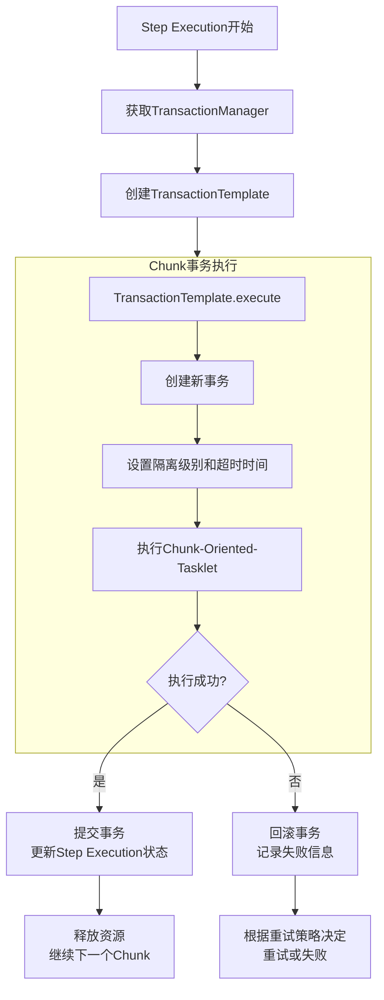
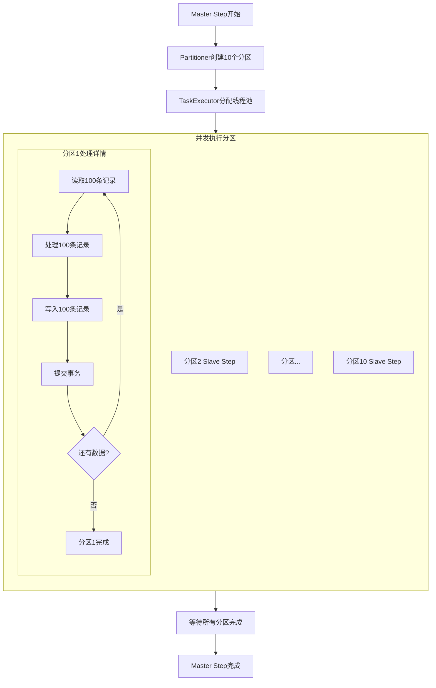
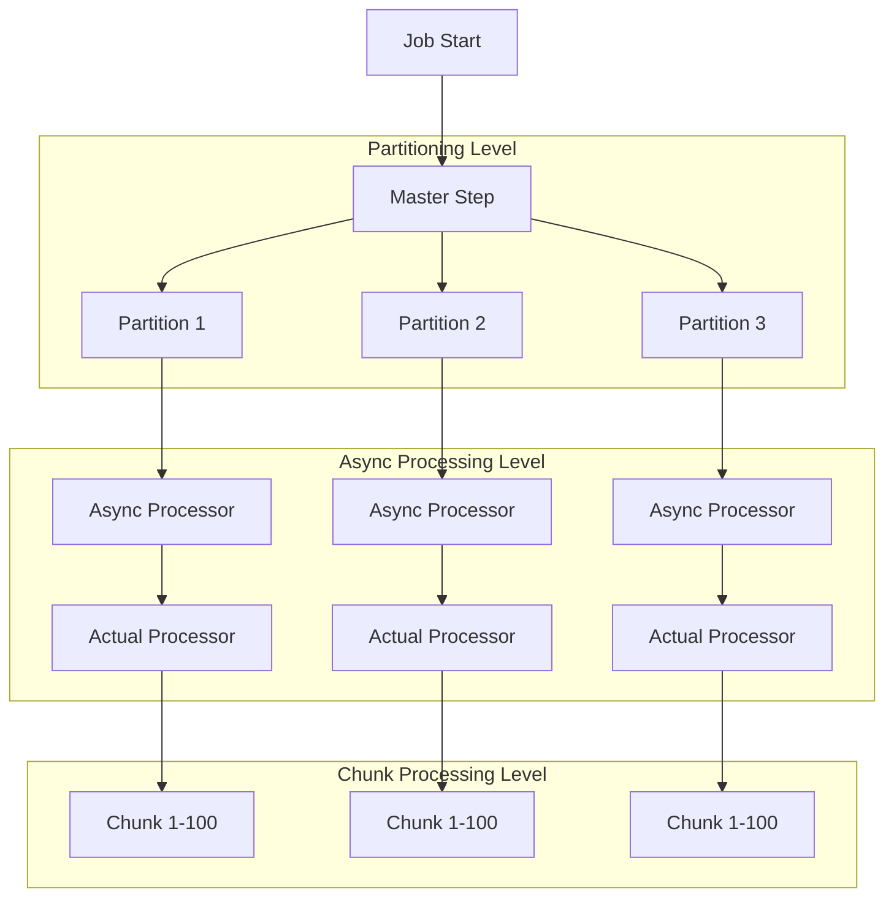
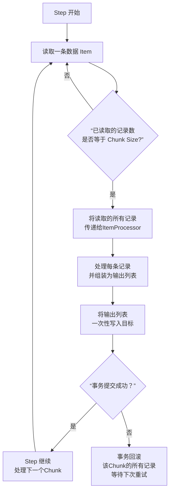

# 特性

- 事务管理
- 分块处理（chunk)
- 声明式I/O
- Start/Stop/Restart
- Retry/Skip


# 事务

## Spring Batch 的事务管理实现

Spring Batch 的事务管理建立在 Spring Framework 的强大事务抽象之上，并针对批处理场景进行了精心设计。

### 1. 核心实现机制

#### 事务划分粒度

Spring Batch 的事务边界主要在 **Step** 和 **Chunk** 两个级别：

```java
@Bean
public Step myStep(JobRepository jobRepository, 
                   PlatformTransactionManager transactionManager) {
    return new StepBuilder("myStep", jobRepository)
            .<Input, Output>chunk(100, transactionManager) // Chunk级别事务
            .reader(reader)
            .processor(processor)
            .writer(writer)
            .transactionManager(transactionManager) // 指定事务管理器
            .build();
}
```

#### 事务管理器集成

Spring Batch 支持多种事务管理器：

```java
// 1. JDBC 事务管理器
@Bean
public DataSourceTransactionManager transactionManager(DataSource dataSource) {
    return new DataSourceTransactionManager(dataSource);
}

// 2. JPA 事务管理器  
@Bean
public JpaTransactionManager transactionManager(EntityManagerFactory emf) {
    return new JpaTransactionManager(emf);
}

// 3. JTA 事务管理器（分布式事务）
@Bean
public JtaTransactionManager transactionManager() {
    return new JtaTransactionManager();
}
```

#### 事务执行流程

以下是 Spring Batch 事务处理的详细流程：



### 2. 事务配置细节

#### 事务属性配置

```java
@Bean
public Step advancedStep(JobRepository jobRepository, 
                        PlatformTransactionManager txManager) {
    return new StepBuilder("advancedStep", jobRepository)
        .<String, String>chunk(100)
        .reader(itemReader())
        .writer(itemWriter())
        .transactionManager(txManager)
        .transactionAttribute(new DefaultTransactionAttribute(
            Propagation.REQUIRED.value(),
            Collections.singletonList(new DefaultTransactionAttribute(
                Propagation.REQUIRES_NEW.value())))) // 传播行为
        .build();
}
```

#### 自定义事务属性

```java
// 配置事务超时和隔离级别
DefaultTransactionAttribute attributes = new DefaultTransactionAttribute();
attributes.setTimeout(30); // 30秒超时
attributes.setIsolationLevel(TransactionDefinition.ISOLATION_READ_COMMITTED);
attributes.setPropagationBehavior(Propagation.REQUIRED.value());
```

## 长事务处理策略

Spring Batch 通过多种机制解决长事务问题：

### 1. Chunk 处理模式 - 核心解决方案

**Chunk 机制是解决长事务的最重要手段**，它将一个大的长事务拆分为多个小事务：

```java
@Bean
public Step chunkedStep() {
    return new StepBuilder("chunkedStep", jobRepository)
            .<Order, Order>chunk(50, transactionManager) // 每50条记录一个事务
            .reader(orderReader())
            .processor(orderProcessor())
            .writer(orderWriter())
            .build();
}
```

**优势：**

- 每个 Chunk 独立提交，避免长时间持有数据库锁
- 内存使用可控，定期清理
- 故障恢复粒度更细，只需重试失败的那个 Chunk

### 2. 游标数据的特殊处理

对于需要保持数据库游标连接的长时读取：

```java
@Bean
@StepScope
public JdbcCursorItemReader<Customer> customerReader(DataSource dataSource) {
    return new JdbcCursorItemReaderBuilder<Customer>()
            .dataSource(dataSource)
            .sql("SELECT id, name FROM customers")
            .rowMapper(new BeanPropertyRowMapper<>(Customer.class))
            .saveState(true) // 保存状态以实现重启
            .driverSupportsAbsolute(true) // 优化大数据集
            .build();
}
```

### 3. 分页读取避免长事务

```java
@Bean
@StepScope
public JdbcPagingItemReader<Customer> pagingReader(DataSource dataSource,
                                                   PagingQueryProvider queryProvider) {
    Map<String, Object> parameterValues = new HashMap<>();
    parameterValues.put("status", "ACTIVE");
    
    return new JdbcPagingItemReaderBuilder<Customer>()
            .dataSource(dataSource)
            .queryProvider(queryProvider)
            .parameterValues(parameterValues)
            .pageSize(100) // 每页100条记录
            .rowMapper(new BeanPropertyRowMapper<>(Customer.class))
            .build();
}
```

### 4. 事务超时设置

防止事务执行时间过长：

```java
@Bean
public Step timeoutStep() {
    DefaultTransactionAttribute attribute = new DefaultTransactionAttribute();
    attribute.setTimeout(60); // 60秒超时
    
    return new StepBuilder("timeoutStep", jobRepository)
            .chunk(100)
            .reader(reader())
            .writer(writer())
            .transactionManager(transactionManager)
            .transactionAttribute(attribute)
            .build();
}
```

### 5. 异步处理与分区处理

对于超大规模数据处理：

#### 异步 ItemProcessor

```java
@Bean
public AsyncItemProcessor<Item, Result> asyncItemProcessor() {
    AsyncItemProcessor<Item, Result> asyncProcessor = new AsyncItemProcessor<>();
    asyncProcessor.setDelegate(syncProcessor());
    asyncProcessor.setTaskExecutor(new SimpleAsyncTaskExecutor());
    return asyncProcessor;
}

@Bean
public AsyncItemWriter<Result> asyncItemWriter() {
    AsyncItemWriter<Result> asyncWriter = new AsyncItemWriter<>();
    asyncWriter.setDelegate(syncWriter());
    return asyncWriter;
}
```

#### 分区处理（Partitioning）

```java
@Bean
public Step masterStep() {
    return new StepBuilder("masterStep", jobRepository)
            .partitioner("slaveStep", partitioner())
            .step(slaveStep())
            .gridSize(10) // 分为10个分区并行处理
            .taskExecutor(taskExecutor())
            .build();
}

@Bean
public Step slaveStep() {
    return new StepBuilder("slaveStep", jobRepository)
            .<Input, Output>chunk(100)
            .reader(reader())
            .writer(writer())
            .build();
}
```

### 6. 状态管理与重启机制

Spring Batch 通过 Repository 管理执行状态，确保事务重启的正确性：

```java
@Bean
public Job job() {
    return new JobBuilder("myJob", jobRepository)
            .start(step1())
            .next(step2())
            .preventRestart(false) // 允许重启
            .listener(jobExecutionListener())
            .build();
}

// 重启时从上次失败的位置继续
@Bean
public JdbcCursorItemReader<Item> restartableReader() {
    JdbcCursorItemReader<Item> reader = new JdbcCursorItemReader<>();
    reader.setSaveState(true); // 保存读取状态
    // ... 其他配置
    return reader;
}
```

## 最佳实践总结

1. **合理设置 Chunk Size**：根据数据特性和系统资源平衡性能与事务时长
2. **使用分页替代游标**：对于大数据集，优先考虑分页读取
3. **配置适当的事务超时**：防止资源长时间锁定
4. **利用异步和分区**：对于计算密集型或IO密集型任务
5. **实现幂等性**：确保 Writer 可以安全重试
6. **监控事务性能**：定期分析事务执行时间和资源使用情况

通过这种设计，Spring Batch 成功地将潜在的长事务问题转化为一系列可控的短事务，既保证了数据一致性，又确保了系统的可伸缩性和可靠性。


# 分区

您的理解完全正确！让我详细解释一下这种配置的具体含义和执行流程。

## 配置含义

```java
.gridSize(10)    // 分区数量 = 10
.chunk(100)      // 每个分区的块大小 = 100
```

这确实表示：**10个分区并发处理，每个并发线程每次处理100条记录**

## 详细执行流程

让我用流程图来展示这个完整的执行过程：



## 具体配置示例

```java
@Bean
public Job partitionedJob() {
    return new JobBuilder("partitionedJob", jobRepository)
            .start(masterStep())
            .build();
}

@Bean
public Step masterStep() {
    return new StepBuilder("masterStep", jobRepository)
            .partitioner("slaveStep", partitioner())  // 设置分区器
            .step(slaveStep())                        // 设置从步骤
            .gridSize(10)                             // 10个分区
            .taskExecutor(taskExecutor())             // 线程池执行
            .build();
}

@Bean
public Step slaveStep() {
    return new StepBuilder("slaveStep", jobRepository)
            .<Input, Output>chunk(100)                // 每个分区chunk大小100
            .reader(reader())
            .processor(processor())
            .writer(writer())
            .build();
}

@Bean
public TaskExecutor taskExecutor() {
    ThreadPoolTaskExecutor executor = new ThreadPoolTaskExecutor();
    executor.setCorePoolSize(10);     // 核心线程数10，与gridSize匹配
    executor.setMaxPoolSize(15);
    executor.setQueueCapacity(50);
    executor.afterPropertiesSet();
    return executor;
}

@Bean
public Partitioner partitioner() {
    return new MyCustomPartitioner();  // 自定义分区逻辑
}
```

## 数据分布示例

假设总数据量：50,000条记录

| 分区   | 处理数据范围  | Chunk次数    | 总处理记录数 |
| ------ | ------------- | ------------ | ------------ |
| 分区1  | 1-5,000       | 50次 × 100条 | 5,000        |
| 分区2  | 5,001-10,000  | 50次 × 100条 | 5,000        |
| 分区3  | 10,001-15,000 | 50次 × 100条 | 5,000        |
| ...    | ...           | ...          | ...          |
| 分区10 | 45,001-50,000 | 50次 × 100条 | 5,000        |

**每个分区执行：** 50次chunk处理（5,000 ÷ 100 = 50）

## 自定义分区器实现

```java
public class RangePartitioner implements Partitioner {
    
    @Override
    public Map<String, ExecutionContext> partition(int gridSize) {
        Map<String, ExecutionContext> result = new HashMap<>();
        
        int totalRecords = 50000;
        int range = totalRecords / gridSize;  // 5000
        
        for (int i = 0; i < gridSize; i++) {
            ExecutionContext context = new ExecutionContext();
            int start = i * range + 1;
            int end = (i == gridSize - 1) ? totalRecords : (i + 1) * range;
            
            context.put("minValue", start);
            context.put("maxValue", end);
            context.put("partitionNumber", i);
            
            result.put("partition" + i, context);
        }
        
        return result;
    }
}
```

## 分区感知的Reader

```java
@Bean
@StepScope
public ItemReader<Customer> partitionAwareReader(
        @Value("#{stepExecutionContext['minValue']}") Long minValue,
        @Value("#{stepExecutionContext['maxValue']}") Long maxValue) {
    
    String sql = "SELECT * FROM customers WHERE id BETWEEN ? AND ?";
    
    return new JdbcCursorItemReaderBuilder<Customer>()
            .dataSource(dataSource)
            .sql(sql)
            .queryArguments(minValue, maxValue)  // 每个分区读取不同范围
            .rowMapper(new BeanPropertyRowMapper<>(Customer.class))
            .build();
}
```

## 性能特点

### 并发优势

- **10个线程并行处理**，理论上速度提升接近10倍
- **每个线程独立事务**，避免锁竞争
- **资源均衡利用**，充分利用多核CPU

### 内存使用

- 每个分区维护自己的100条记录缓存
- 总内存占用 = 10分区 × 100条 × 记录大小
- 比单线程处理50,000条内存压力小很多

### 错误隔离

- 单个分区失败不影响其他分区
- 可以单独重试失败的分区
- 细粒度的故障恢复

## 最佳实践建议

1. **gridSize与线程池匹配**：确保线程池足够处理所有并发分区
2. **合理设置chunk大小**：平衡事务性能和内存使用
3. **考虑数据倾斜**：确保分区数据分布均匀
4. **监控资源使用**：避免过多并发导致系统过载
5. **数据库连接池**：确保连接数足够支持并发分区

```yaml
# 典型配置考虑
gridSize: CPU核心数 × 1.5  # 如 8核CPU设置12个分区
chunkSize: 50-200          # 根据记录大小调整
线程池: 略大于gridSize     # 如gridSize=10, 线程池=12
数据库连接: 大于总并发数   # 确保每个分区有连接可用
```

这种分区并发处理模式是Spring Batch处理大数据量的核心武器，能够显著提升处理效率！

# 分区 VS 异步

这是一个非常好的问题！**使用分区后，通常不需要再额外添加异步处理**，因为分区本身已经是一种更高级别的并行处理机制。让我详细分析它们的关系和使用场景。

## 核心关系分析

### 1. 分区已经实现了并发

```java
// 分区本身已经是并发处理
.gridSize(10)                    // 10个分区并发
.taskExecutor(taskExecutor())    // 线程池执行
```

**分区在本质上就是异步的** - 多个分区在不同的线程中同时执行。

### 2. 架构层次对比

让我通过架构图来展示两者的层次关系：



## 具体场景分析

### 场景1：纯分区（推荐大多数情况）

```java
@Bean
public Step masterStep() {
    return new StepBuilder("masterStep", jobRepository)
            .partitioner("slaveStep", partitioner())
            .step(slaveStep())
            .gridSize(10)           // 10个分区并发
            .taskExecutor(taskExecutor()) // 线程池执行
            .build();
}

@Bean  
public Step slaveStep() {
    return new StepBuilder("slaveStep", jobRepository)
            .<Input, Output>chunk(100)  // 每个分区同步处理
            .reader(reader())
            .processor(processor())     // 同步processor
            .writer(writer())           // 同步writer
            .build();
}
```

### 场景2：分区 + 异步（特定复杂场景）

```java
@Bean
public Step masterStep() {
    return new StepBuilder("masterStep", jobRepository)
            .partitioner("slaveStep", partitioner())
            .step(slaveStep())
            .gridSize(10)
            .taskExecutor(taskExecutor())
            .build();
}

@Bean
public Step slaveStep() {
    return new StepBuilder("slaveStep", jobRepository)
            .<Input, Output>chunk(100)
            .reader(reader())
            .processor(asyncItemProcessor())  // 异步processor
            .writer(asyncItemWriter())        // 异步writer
            .build();
}
```

## 什么时候需要组合使用？

只有在**特定场景**下才考虑分区+异步的组合：

### 场景1：I/O密集型Processor

```java
// 当Processor需要调用外部服务，存在大量等待时间
@Bean
public AsyncItemProcessor<Item, Result> asyncItemProcessor() {
    AsyncItemProcessor<Item, Result> asyncProcessor = new AsyncItemProcessor<>();
    asyncProcessor.setDelegate(slowServiceCallProcessor()); // 调用慢速外部服务
    asyncProcessor.setTaskExecutor(ioTaskExecutor()); // 专用I/O线程池
    return asyncProcessor;
}

// 专用I/O线程池
@Bean
public TaskExecutor ioTaskExecutor() {
    ThreadPoolTaskExecutor executor = new ThreadPoolTaskExecutor();
    executor.setCorePoolSize(20);  // 更多线程处理I/O等待
    executor.setMaxPoolSize(50);
    executor.setQueueCapacity(100);
    return executor;
}
```

### 场景2：复杂的多阶段处理

```java
// Processor内部需要并行处理多个子任务
public class ComplexProcessor implements ItemProcessor<Input, Output> {
    @Async
    public CompletableFuture<Intermediate> stage1(Input input) {
        // 第一阶段处理
    }
    
    @Async  
    public CompletableFuture<Intermediate> stage2(Input input) {
        // 第二阶段处理
    }
    
    @Override
    public Output process(Input item) throws Exception {
        // 组合多个异步任务
        CompletableFuture.allOf(stage1(item), stage2(item)).join();
        return finalResult;
    }
}
```

## 性能考虑

### 资源消耗对比

| 配置方案  | CPU使用 | 内存使用 | 线程数                  | 复杂度 |
| --------- | ------- | -------- | ----------------------- | ------ |
| 纯分区    | 高      | 中       | gridSize                | 低     |
| 分区+异步 | 很高    | 高       | gridSize × asyncThreads | 高     |
| 纯异步    | 中      | 中       | asyncThreads            | 中     |

### 潜在问题

```java
// 过度配置导致资源竞争
.gridSize(10)                    // 10个分区
.taskExecutor(20Threads)         // 20线程

// 加上异步后：
.asyncProcessor(10Threads)       // 每个分区10个异步线程
// 总线程数：10分区 × 10线程 = 100线程！
// 可能导致：线程竞争、内存溢出、数据库连接耗尽
```

## 实践建议

### 推荐方案（90%场景）

```java
// 1. 先尝试纯分区
.gridSize(CPU核心数 × 1.5)
.chunk(适当大小)

// 2. 监控性能，如果Processor是瓶颈再考虑异步
```

### 决策流程

```java
public class ProcessingStrategyDecider {
    
    public boolean needAsyncProcessing() {
        // 检查是否I/O密集型
        if (isIOIntensive(processor)) {
            return true;
        }
        
        // 检查是否有外部服务调用
        if (hasExternalServiceCalls(processor)) {
            return true;
        }
        
        // 检查处理时间是否很长
        if (getAverageProcessTime() > 1000) { // 1秒以上
            return true;
        }
        
        return false;
    }
}
```

## 监控和调优

```java
@EventListener
public void monitorChunkPerformance(ChunkContext chunkContext) {
    StepExecution stepExecution = chunkContext.getStepContext().getStepExecution();
    long processTime = stepExecution.getProcessSkipCount(); // 监控处理时间
    
    // 如果发现Processor是瓶颈：
    if (processTime > chunkTime * 0.8) {
        // 考虑引入异步处理
        logger.info("Processor is bottleneck, consider async processing");
    }
}
```

## 总结

**大多数情况下，分区本身就足够了**。只有在以下特定场景才考虑分区+异步：

1. **Processor是I/O密集型**（调用外部API、数据库复杂查询等）
2. **需要更细粒度的并行度** 
3. **处理时间非常长且可并行化**
4. **系统资源充足**，能够承受额外的线程开销

**建议的实践路径：**

1. 先从纯分区开始
2. 监控性能指标
3. 识别具体瓶颈
4. 必要时才引入异步处理

记住：**复杂度越高，调试和维护越困难**。保持简单通常是更好的选择。


# Chunk

### 1. 核心思想：化整为零

想象一下，你要从一辆卡车上把一万本书搬进图书馆。

*   **错误的方式**：你试图一次抱起所有书。结果很可能是你根本抱不起来，或者中途摔倒，书散落一地，你也不知道哪些搬了哪些没搬。
*   **正确的方式（Chunk方式）**：你拿一个箱子，一次搬20本。你搬完20本，记录一下“我已经搬了20本了”，然后把箱子清空，再去搬下一箱20本。这样既轻松，又容易跟踪进度，万一中途累了需要休息，你也知道从第几本开始继续。

Spring Batch 的 Chunk 处理就是这个“箱子”。

### 2. 官方定义

在 Spring Batch 中，**Chunk（块）是一次事务中处理的数据项的集合**。

它不是一个具体的类，而是一个**处理模型**或**处理单元**。一个 Step 的执行就是由这样一个个 Chunk 连续完成构成的。

### 3. Chunk 的处理流程（核心生命周期）

一个 Chunk 的完整生命周期包含以下几个步骤，下图清晰地展示了这一过程：



让我们用代码和说明来详细解释图中的每一步：

1. **读取（Read）**

   *   `ItemReader` 被重复调用，一次读取一条数据（比如从数据库、文件、队列中）。
   *   这些数据会被暂时存储在一个列表中。

   ```java
   // 伪代码逻辑
   List items = new ArrayList<>();
   for (int i = 0; i < chunkSize; i++) {
       Object item = itemReader.read();
       if (item == null) {
           break; // 如果数据源没有更多数据，则提前结束
       }
       items.add(item);
   }
   ```

2. **处理（Process）（可选）**

   *   当读取的数据条数达到预设的 `chunk size` 时，会将这个数据列表交给 `ItemProcessor`。
   *   `ItemProcessor` 可以对每条数据进行业务逻辑处理、数据转换、过滤等。
   *   如果 `ItemProcessor` 返回 `null`，则该条数据会被过滤掉，不会传递给写入器。

   ```java
   // 伪代码逻辑
   List processedItems = new ArrayList<>();
   for (Object item : items) {
       Object processedItem = itemProcessor.process(item);
       if (processedItem != null) {
           processedItems.add(processedItem);
       }
   }
   ```

3. **写入（Write）**

   *   将处理后的数据列表（`processedItems`）**一次性**交给 `ItemWriter`。
   *   `ItemWriter` 通常会执行批量操作，例如一次性插入/更新数据库、批量写入文件等。

   ```java
   // 伪代码逻辑
   itemWriter.write(processedItems);
   ```

4. **提交（Commit）**

   *   在整个 Chunk 的“读-处理-写”操作成功完成后，Spring Batch 会**提交事务**。
   *   **这是最关键的一点**：**一个 Chunk 对应一个事务**。如果在第100条记录写入时失败，整个 Chunk（比如100条记录）的所有操作都会回滚。数据库会回到这个 Chunk 开始之前的状态。Step 重启时，会从上一个**成功提交的 Chunk** 之后继续读取。

### 4. 如何配置 Chunk

在定义 Step 时，我们使用 `chunk(int chunkSize)` 方法来配置块的大小。

```java
@Bean
public Step myStep(JobRepository jobRepository, 
                   PlatformTransactionManager transactionManager,
                   ItemReader myReader,
                   ItemProcessor myProcessor,
                   ItemWriter myWriter) {
    return new StepBuilder("myStep", jobRepository)
            .chunk(100, transactionManager) // 关键！这里定义Chunk大小为100
            .reader(myReader)
            .processor(myProcessor)
            .writer(myWriter)
            .build();
}
```

### 5. Chunk 模式的优势

1.  **性能优异**：通过批量写入，极大地减少了与数据库等外部系统交互的 I/O 开销。相比每条记录都开启和提交一个事务，效率高出几个数量级。
2.  **事务安全**：将事务边界控制在 Chunk 级别，避免了处理百万条数据时一个长事务占用大量数据库资源。同时，在失败时，只有当前失败的 Chunk 会回滚，不会丢失所有进度。
3.  **内存友好**：它不会一次性将所有数据加载到内存中。它处理完一个 Chunk 就会提交、清理，然后处理下一个 Chunk，有效防止内存溢出（OOM）。
4.  **易于恢复和监控**：由于每个 Chunk 都是一个独立的单元，作业失败后可以精确地从断点继续。框架也能方便地记录已处理的 Chunk 数量。

### 总结

**Chunk** 是 Spring Batch 为高效、可靠地处理**大量数据**而设计的核心处理模型。它将“一条一条”的处理方式，提升为“**一箱一箱**”的处理方式，其中 **“箱子的尺寸”就是 `chunk-size`**，而 **“搬完一箱”就对应一次“事务提交”**。

理解 Chunk 的概念，是掌握 Spring Batch 的关键。

# Declarative I/O

好的，这是一个很好的问题。**Spring Batch Declarative I/O** 并不是 Spring Batch 官方文档中一个独立的、有明确定义的术语，而更像是一个**社区和实践者总结出来的概念和最佳实践模式**。

它指的是利用 Spring 的依赖注入和配置化方式来**声明式地**定义和管理批处理作业中的输入（Input）和输出（Output）组件，而不是在代码中硬编码它们的创建和配置。

## 核心理念

**从“如何做”到“做什么”**

- **指令式（Imperative）**：编写大量代码来手动创建 Reader、Writer，设置它们的属性，管理它们的生命周期。
- **声明式（Declarative）**：通过配置（Java Config、XML、属性文件）来“声明”你需要什么样的 Reader 和 Writer，让框架来组装和执行。

## 关键实现技术

Declarative I/O 主要依赖于以下几个 Spring 和 Spring Batch 的核心特性：

### 1. `@StepScope` 和延迟绑定

这是实现 Declarative I/O 的**基石**。它允许在 Step 执行时才创建 Bean，并且可以注入来自 Job 或 Step 执行上下文的参数。

```java
@Bean
@StepScope // 关键注解：每个Step执行时创建一个新的Reader实例
public FlatFileItemReader<Person> reader(
        @Value("#{jobParameters['input.file.name']}") String resource) {
    // 通过SpEL从Job参数动态获取文件名
    return new FlatFileItemReaderBuilder<Person>()
            .name("personReader")
            .resource(new FileSystemResource(resource)) // 声明式指定资源
            .delimited()
            .names("firstName", "lastName", "age") // 声明式指定字段名
            .targetType(Person.class) // 声明式指定目标类型
            .build();
}
```

### 2. 流畅的 Builder API

Spring Batch 为大多数 Reader/Writer 提供了流畅的 Builder，使得配置过程非常声明式。

```java
@Bean
public JdbcBatchItemWriter<Person> writer(DataSource dataSource) {
    return new JdbcBatchItemWriterBuilder<Person>()
            .itemSqlParameterSourceProvider(
                new BeanPropertyItemSqlParameterSourceProvider<>()) // 声明SQL参数映射
            .sql("INSERT INTO people (first_name, last_name, age) VALUES (:firstName, :lastName, :age)") // 声明SQL
            .dataSource(dataSource)
            .build();
}
```

### 3. 外部化配置

将所有的 I/O 配置（如文件路径、SQL 查询、字段映射等）外部化到配置文件（如 `application.yml`）中。

```yaml
# application.yml
batch:
  input:
    file: classpath:data/input.csv
  output:
    table: people
    chunk-size: 100
    sql: "INSERT INTO ${batch.output.table} (first_name, last_name, age) VALUES (:firstName, :lastName, :age)"
```

然后在配置类中引用：

```java
@Configuration
@EnableConfigurationProperties(BatchProperties.class)
public class BatchConfig {
    
    @Bean
    @StepScope
    public FlatFileItemReader<Person> reader(
            @Value("${batch.input.file}") Resource resource,
            @Value("${batch.output.chunk-size}") int chunkSize) {
        return new FlatFileItemReaderBuilder<Person>()
                .resource(resource)
                // ... 其他配置
                .build();
    }
}
```

## 完整示例：声明式文件处理

下面是一个完整的 Declarative I/O 示例，展示了如何声明式地处理从文件到数据库的批处理作业：

```java
@Configuration
@EnableBatchProcessing
public DeclarativeBatchConfiguration {

    // 1. 声明式 Reader
    @Bean
    @StepScope
    public FlatFileItemReader<Transaction> transactionReader(
            @Value("#{jobParameters['inputFile']}") String inputFile) {
        
        return new FlatFileItemReaderBuilder<Transaction>()
                .name("transactionReader")
                .resource(new PathResource(inputFile))
                .linesToSkip(1) // 跳过标题行
                .delimited()
                .delimiter(",")
                .names("id", "amount", "timestamp", "customerId")
                .fieldSetMapper(new BeanWrapperFieldSetMapper<Transaction>() {{
                    setTargetType(Transaction.class);
                }})
                .build();
    }

    // 2. 声明式 Processor（可选）
    @Bean
    @StepScope
    public ItemProcessor<Transaction, EnrichedTransaction> transactionProcessor(
            @Value("#{jobParameters['processingDate']}") String processingDate) {
        
        return transaction -> {
            EnrichedTransaction enriched = new EnrichedTransaction();
            enriched.setId(transaction.getId());
            enriched.setAmount(transaction.getAmount());
            enriched.setProcessingDate(LocalDate.parse(processingDate));
            // 声明式地添加处理逻辑
            if (transaction.getAmount() > 1000) {
                enriched.setCategory("LARGE");
            } else {
                enriched.setCategory("STANDARD");
            }
            return enriched;
        };
    }

    // 3. 声明式 Writer
    @Bean
    @StepScope
    public JdbcBatchItemWriter<EnrichedTransaction> transactionWriter(
            DataSource dataSource,
            @Value("#{jobParameters['outputTable']}") String tableName) {
        
        return new JdbcBatchItemWriterBuilder<EnrichedTransaction>()
                .itemSqlParameterSourceProvider(
                    new BeanPropertyItemSqlParameterSourceProvider<>())
                .sql(String.format(
                    "INSERT INTO %s (id, amount, processing_date, category) " +
                    "VALUES (:id, :amount, :processingDate, :category)", tableName))
                .dataSource(dataSource)
                .build();
    }

    // 4. 声明式 Step 配置
    @Bean
    public Step processTransactionsStep(StepBuilderFactory stepBuilderFactory,
                                       ItemReader<Transaction> reader,
                                       ItemProcessor<Transaction, EnrichedTransaction> processor,
                                       ItemWriter<EnrichedTransaction> writer,
                                       @Value("${batch.chunk.size:100}") int chunkSize) {
        
        return stepBuilderFactory.get("processTransactionsStep")
                .<Transaction, EnrichedTransaction>chunk(chunkSize) // 声明chunk大小
                .reader(reader)
                .processor(processor)
                .writer(writer)
                .listener(new DeclarativeStepExecutionListener())
                .build();
    }

    // 5. 声明式 Job 配置
    @Bean
    public Job transactionProcessingJob(JobBuilderFactory jobBuilderFactory,
                                       @Qualifier("processTransactionsStep") Step step) {
        
        return jobBuilderFactory.get("transactionProcessingJob")
                .incrementer(new RunIdIncrementer())
                .start(step)
                .validator(parametersValidator()) // 声明式参数验证
                .build();
    }

    // 6. 声明式参数验证器
    @Bean
    public JobParametersValidator parametersValidator() {
        return new DefaultJobParametersValidator(
            new String[]{"inputFile", "processingDate", "outputTable"}, // 必需参数
            new String[]{"run.id"} // 可选参数
        );
    }
}
```

## 优势总结

1. **配置与代码分离**：I/O 细节（文件路径、SQL、字段映射）都在配置中，不污染业务逻辑。

2. **易于测试**：可以轻松地注入模拟的依赖。

   ```java
   @Test
   void testReader() {
       // 可以独立测试配置好的Reader
       Transaction transaction = reader.read();
       assertThat(transaction).isNotNull();
   }
   ```

3. **动态性**：通过 Job Parameters 和 SpEL，可以在运行时决定资源位置、处理逻辑等。

4. **可维护性**：配置集中管理，修改 I/O 源或目标时不需要修改代码。

5. **可复用性**：配置好的组件可以在不同的 Step 和 Job 中复用。

## 与现代云原生批处理的结合

在云原生环境中，Declarative I/O 的理念更加重要：

```java
@Bean
@StepScope
public ItemReader<CloudRecord> cloudStorageReader(
        @Value("#{jobParameters['gcs.bucket']}") String bucket,
        @Value("#{jobParameters['gcs.prefix']}") String prefix) {
    
    // 声明式地从Google Cloud Storage读取
    return new GcsItemReaderBuilder<CloudRecord>()
            .bucket(bucket)
            .prefix(prefix)
            .objectMapper(objectMapper)
            .build();
}
```

## 总结

**Spring Batch Declarative I/O** 是一种**设计和配置模式**，它强调：

- **通过配置而非代码**来定义数据流
- **利用 Spring 的依赖注入和 Scope 机制**实现动态性
- **使用流畅的 Builder API** 提高可读性
- **外部化配置**以提高可维护性

它不是一个新的 API，而是对现有 Spring Batch 特性的一种**最佳实践用法**，使得批处理作业的 I/O 部分更加灵活、可配置和易于管理。


# start/stop/restart

好的，这个问题非常具体，它指的是 **Spring Batch 作业的生命周期管理**，与普通的 Spring 应用上下文生命周期完全不同。

Spring Batch 的 Start/Stop/Restart 是围绕 **Job（作业）** 和 **Job Execution（作业执行）** 的核心概念展开的。由于其处理的是可能运行很长时间的批处理任务，所以这些操作具有非常精确的含义。

---

### 核心概念

首先，理解两个关键对象：

1.  **Job（作业）**： 一个批处理流程的蓝图。它由多个 `Step` 组成，定义了整个处理流程。例如，“月末结算作业”。
2.  **Job Instance（作业实例）**： 一个 Job 的逻辑执行。通常由 `Job` 和识别本次运行的参数（如 `jobParameters`）共同确定。例如，“2024年5月的月末结算”就是一个 Job Instance。
3.  **Job Execution（作业执行）**： 一个 Job Instance 的**物理执行**。一个 Job Instance 可能会因为失败而执行多次，但每次尝试都是一个独立的 Job Execution。

现在，我们来解释这三个操作：

---

### 1. Start（启动）

*   **含义**： **启动一个新的 Job Execution**。
*   **触发方式**：
    *   通过命令行（例如，使用 `java -jar` 并传递作业参数）。
    *   通过 REST API 调用 `JobLauncher`。
    *   由调度器（如 Quartz, Spring Scheduler）触发。
*   **内部过程**：
    1.  **检查参数**： Spring Batch 接收 `JobParameters`（例如 `run.date=20240527`）。
    2.  **创建 Job Instance**： 根据 Job 名称和 `JobParameters`，在 `JobRepository` 中查找或创建一个新的 Job Instance。
    3.  **创建 Job Execution**： 为该 Job Instance 创建一个新的、状态为 `STARTING` 的 Job Execution。
    4.  **执行 Job**： 按顺序执行 Job 中定义的各个 `Step`（读取、处理、写入）。
    5.  **更新状态**： 作业完成后，其状态更新为 `COMPLETED`；如果失败，则更新为 `FAILED`。

**关键点**： “Start” 总是尝试为给定的参数集**开启一次新的运行**。

---

### 2. Stop（停止）

*   **含义**： **主动地、优雅地停止一个正在运行的 Job Execution**。
*   **触发方式**：
    *   通常通过应用程序的管理端点（如 `actuator` 端点）或自定义的 REST API。
    *   在代码中调用 `JobOperator.stop(executionId)`。
*   **内部过程**：
    1.  **设置停止标志**： Spring Batch 不会立即杀死进程，而是向正在运行的 `Step` 设置一个停止请求标志。
    2.  **等待当前 chunk 完成**： 当前正在处理的一批数据（一个 chunk）会正常完成（处理完并提交事务）。
    3.  **更新状态**： 在当前 chunk 成功提交后，作业执行的状态会被标记为 `STOPPED`。
    4.  **持久化进度**： 已经处理完成的记录和状态会保存在 `JobRepository` 中。

**关键点**： “Stop” 是可控的，它保存了断点，允许后续从停止点**重新启动**。这与强制杀死进程（`KILL`）有本质区别，后者可能导致状态不一致。

---

### 3. Restart（重启）

*   **含义**： **重新运行一个状态为 `FAILED` 或 `STOPPED` 的 Job Execution 所属的 Job Instance**。
*   **触发方式**：
    *   与 “Start” 类似，但使用**完全相同**的 `JobParameters`。
    *   Spring Batch 检测到该 Job Instance 已有失败的执行记录，会自动触发重启逻辑。
*   **内部过程**：
    1.  **查找历史**： 根据 Job 名称和 `JobParameters`，找到对应的 Job Instance 和其上一次 `FAILED`/`STOPPED` 的 Job Execution。
    2.  **识别可重启的 Step**：
        *   对于已经 `COMPLETED` 的 Step，Spring Batch 会**跳过**它们。这是 Spring Batch 最强大的特性之一。
        *   找到第一个未完成的 Step（状态为 `FAILED` 或 `STOPPED`）。
    3.  **从断点继续**： 在未完成的 Step 中，它会从上次成功提交的 chunk 之后开始读取和处理数据。
    4.  **创建新的 Job Execution**： 重启会创建一个新的 Job Execution 来代表这次新的尝试。

**关键点**： “Restart” 利用了 Spring Batch 的元数据表来保证**不重复处理**和**从断点续跑**。

---

### 总结与类比

为了让您更好地理解，这里有一个简单的类比：

| 操作        | Spring Batch 含义             | 现实世界类比（写一本100页的书）                              |
| :---------- | :---------------------------- | :----------------------------------------------------------- |
| **Start**   | **首次启动一个作业**          | 你从第一页开始写一本新书。                                   |
| **Stop**    | **优雅停止一个运行中的作业**  | 你写到了第50页，然后做个标记，合上书。你知道自己停在了哪里。 |
| **Restart** | **从上次失败/停止的地方继续** | 你重新打开书，直接从第51页开始写，而不是从第1页重写。        |

### 如何实现这些操作？

在实践中，你通常会：

*   **Start**： 使用 `JobLauncher` 并传入 `JobParameters`。
*   **Stop/Restart**： 使用 `JobOperator` 接口，它提供了 `stop(long executionId)` 和 `restart(long executionId)` 等方法。这些方法通常通过一个管理界面或API来调用。

通过这种设计，Spring Batch 为处理大规模、长时间运行的批处理任务提供了强大且可靠的容错和管理能力。


# retry/skip

好的，这个问题触及了 Spring Batch 在处理错误和数据异常时的核心容错机制。**Retry（重试）** 和 **Skip（跳过）** 是保证批处理作业稳定性和健壮性的两个关键特性。

它们解决的问题不同，但经常结合使用。

---

### 1. Retry（重试）

#### **含义**

**重试**是指当某个操作因为**临时性、可预期的故障**而失败时，自动重新执行该操作，而不是立即让整个作业失败。

#### **设计目的**

处理那些**可能很快自行恢复的瞬时异常**。例如：

*   **网络短暂中断**（调用外部API超时）
*   **数据库死锁**（`DeadlockLoserDataAccessException`）
*   **临时性的资源不可用**

这些错误的特点是，**稍等片刻再试一次，很可能就会成功**。

#### **工作原理**

1.  在配置的步骤（Step）中，为某个操作（如：`ItemProcessor` 或 `ItemWriter`）声明一个重试策略。
2.  当该操作抛出配置中指定的异常时，Spring Batch 不会立即标记该 Chunk 为失败。
3.  它会等待一段预定义的时间（可配置），然后重新执行该操作。
4.  如果重试后成功，处理流程将继续，就像什么都没发生过一样。
5.  如果达到了最大重试次数仍然失败，那么这个异常将被抛出，进而触发 Chunk 级别的回滚，并可能进入 Skip 流程或导致步骤失败。

#### **配置示例**

你可以在 Step 中为 Processor 或 Writer 配置重试策略。

```java
@Bean
public Step myStep(JobRepository jobRepository, PlatformTransactionManager transactionManager) {
    return new StepBuilder("myStep", jobRepository)
        .<String, String>chunk(10, transactionManager)
        .reader(reader())
        .processor(processor())
        .writer(writer())
        .faultTolerant()
        .retry(DeadlockLoserDataAccessException.class) // 指定重试的异常类型
        .retryLimit(3) // 最大重试次数
        //.backOffPolicy(new ExponentialBackOffPolicy()) // 可选：设置重试间隔策略
        .build();
}
```

---

### 2. Skip（跳过）

#### **含义**

**跳过**是指当处理一条记录（Item）过程中发生错误时，**跳过这条“有问题”的记录**，并继续处理下一条记录，而不是让整个 Chunk 失败。

#### **设计目的**

处理那些**与单条数据相关的、不可恢复的业务逻辑错误**。例如：

*   **数据格式不正确**（如日期字段解析失败）
*   **业务规则验证失败**（如年龄为负数）
*   **数据库约束违反**（如插入重复主键）
*   **在重试之后仍然失败的瞬时异常**（如果配置了先重试后跳过）

这些错误的特点是，**无论重试多少次，这条特定的数据都会失败**。为了不让“一颗老鼠屎坏了一锅粥”，我们选择跳过它。

#### **工作原理**

1.  在 Step 中配置可跳过的异常和跳过限制。
2.  当在 `ItemReader`, `ItemProcessor` 或 `ItemWriter` 中抛出配置中指定的可跳过异常时：
    *   Spring Batch 会捕获这个异常。
    *   它会检查是否还未达到跳过的最大次数限制。
    *   如果未达到，它会记录下这条被跳过的记录（通常会记录到执行上下文中），然后继续处理 Chunk 中的下一条记录。
    *   整个 Chunk 的**事务不会被回滚**，因为只有一条记录出了问题。

#### **配置示例**

```java
@Bean
public Step myStep(JobRepository jobRepository, PlatformTransactionManager transactionManager) {
    return new StepBuilder("myStep", jobRepository)
        .<String, String>chunk(10, transactionManager)
        .reader(reader())
        .processor(processor())
        .writer(writer())
        .faultTolerant()
        .skip(FlatFileParseException.class) // 在读取时跳过文件解析错误
        .skip(ValidationException.class) // 在处理时跳过业务验证错误
        .skipLimit(100) // 整个Step最多允许跳过100条记录
        // 也可以为不同的异常设置不同的跳过限制
        //.skipPolicy(new LimitCheckingItemSkipPolicy())
        .build();
}
```

---

### Retry 和 Skip 的结合使用

这是最常见的生产环境配置模式：**先重试，重试失败后再跳过**。

这种策略非常强大，它可以：

1.  **自动克服瞬时性问题**（通过重试）。
2.  **确保作业不会被个别“坏数据”阻塞**，从而实现高完成率（通过跳过）。

#### **结合使用的流程**

当一个异常被抛出时（例如在 `ItemWriter` 中）：

1.  Spring Batch 首先检查这个异常是否在 **Retry 列表**中。
    *   如果是，并且未达到重试上限，则进行重试。
    *   如果重试成功，流程继续。
    *   如果重试多次后仍失败，则异常被抛出到 Chunk 级别。
2.  在 Chunk 级别，Spring Batch 检查这个异常是否在 **Skip 列表**中。
    *   如果是，并且未达到跳过上限，则**跳过导致这次 Writer 调用失败的整个 Chunk 中的记录**（注意：对于 Writer，跳过的单位是 Chunk，因为它可能是一次批量写入），并记录日志。
    *   如果不可跳过，或达到跳过上限，则整个 Step 失败。

#### **结合配置示例**

```java
@Bean
public Step robustStep(JobRepository jobRepository, PlatformTransactionManager transactionManager) {
    return new StepBuilder("robustStep", jobRepository)
        .<Input, Output>chunk(100, transactionManager)
        .reader(reader())
        .processor(processor())
        .writer(writer())
        .faultTolerant()
        // 先配置重试：针对瞬时异常
        .retry(DeadlockLoserDataAccessException.class)
        .retry(RemoteAccessException.class)
        .retryLimit(3)
        // 再配置跳过：针对数据问题或最终仍失败的瞬时异常
        .skip(FlatFileParseException.class)
        .skip(DataIntegrityViolationException.class)
        .skip(RemoteAccessException.class) // 重试3次后仍失败，则跳过
        .skipLimit(50)
        .build();
}
```

### 总结

| 特性              | 解决的问题                   | 粒度                                 | 目标                                                         |
| :---------------- | :--------------------------- | :----------------------------------- | :----------------------------------------------------------- |
| **Retry（重试）** | **瞬时性、可恢复的故障**     | 操作级别（一次读取、处理或写入调用） | **提高作业成功率**，避免因短暂问题而失败。                   |
| **Skip（跳过）**  | **永久性、与数据相关的故障** | 记录级别（一条数据）                 | **提高作业完成率**，保证大部分数据能被处理，不因个别坏数据而停滞。 |

简单来说：

*   **重试是针对“环境”的容错**（希望环境快点好起来）。
*   **跳过是针对“数据”的容错**（承认这条数据有问题，放弃它）。

将它们结合，就能构建出一个非常健壮和可靠的批处理应用。


# Pass attributes between steps


The ExecutionContext allows you to store key-value pairs that can be shared between steps.

**Writing data in Step 1:**

java

```java
@Bean
public Step step1(JobRepository jobRepository, PlatformTransactionManager transactionManager) {
    return new StepBuilder("step1", jobRepository)
        .tasklet((contribution, chunkContext) -> {
            ExecutionContext executionContext = chunkContext.getStepContext()
                .getStepExecution()
                .getJobExecution()
                .getExecutionContext();
            
            executionContext.put("sharedData", "some value");
            executionContext.putInt("count", 100);
            
            return RepeatStatus.FINISHED;
        }, transactionManager)
        .build();
}
```

**Reading data in Step 2:**

java

```java
@Bean
public Step step2(JobRepository jobRepository, PlatformTransactionManager transactionManager) {
    return new StepBuilder("step2", jobRepository)
        .tasklet((contribution, chunkContext) -> {
            ExecutionContext executionContext = chunkContext.getStepContext()
                .getStepExecution()
                .getJobExecution()
                .getExecutionContext();
            
            String data = executionContext.getString("sharedData");
            int count = executionContext.getInt("count");
            
            System.out.println("Received: " + data + ", Count: " + count);
            
            return RepeatStatus.FINISHED;
        }, transactionManager)
        .build();
}
```


# Video

- keep the computer busy
- 概念
  - Job
    - Step
      - Item
      - Chunk
      - Reader
      - ItemProcessor
      - Writer
  - Job Repository
- 场景
  - CSV 输入处理
  - 


